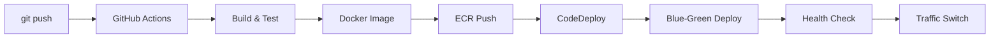

# 🌟 Spring Backend

> **현대적인 Java 21과 Spring Boot 3.5.4 기반의 확장 가능한 백엔드 API 서버**

[](https://openjdk.org/projects/jdk/21/)
[](https://spring.io/projects/spring-boot)
[](https://gradle.org/)
[](LICENSE)

## 🚀 주요 특징

- **🏗️ Domain-Driven Design**: 비즈니스 도메인 중심의 모듈화된 아키텍처
- **☕ Modern Java 21**: Record, Pattern Matching, Text Blocks 등 최신 기능 활용  
- **🔒 Security First**: Spring Security 기반 JWT 인증/인가 시스템
- **📚 API-First**: OpenAPI 3.0 기반 자동 문서화 및 Swagger UI 제공
- **🎯 Clean Architecture**: 명확한 계층 분리와 의존성 관리
- **⚡ High Performance**: Redis 캐싱, JPA 최적화, N+1 문제 해결
- **🧪 Test-Driven**: 포괄적인 단위 테스트 및 통합 테스트
- **🔧 Developer Experience**: 상세한 문서화와 개발 도구 지원

## 🛠️ 기술 스택

### 백엔드
- **Framework**: Spring Boot 3.5.4
- **Language**: Java 21 (LTS)
- **Build Tool**: Gradle 8.14.3+
- **Security**: Spring Security 6.x

### 데이터베이스 & 캐시
- **Primary Database**: MySQL 8.0+
- **ORM**: Spring Data JPA + Hibernate
- **Cache**: Redis 6.0+

### 문서화 & 테스트
- **API Documentation**: SpringDoc OpenAPI 3
- **Testing**: JUnit 5, Mockito, TestContainers
- **Code Quality**: SonarQube 지원

## ⚡ 빠른 시작

### 사전 요구사항
- Java 21+
- MySQL 8.0+
- Redis 6.0+

### 1. 저장소 클론
```bash
git clone <repository-url>
cd spring-backend
```

### 2. 데이터베이스 설정
```sql
CREATE DATABASE spring_backend_db CHARACTER SET utf8mb4 COLLATE utf8mb4_unicode_ci;
CREATE USER 'spring_user'@'localhost' IDENTIFIED BY 'spring_password';
GRANT ALL PRIVILEGES ON spring_backend_db.* TO 'spring_user'@'localhost';
```

### 3. 애플리케이션 실행
```bash
# Unix/Linux/macOS
./gradlew bootRun

# Windows
gradlew.bat bootRun
```

### 4. 접속 확인
- **API 서버**: http://localhost:3055/api
- **Swagger UI**: http://localhost:3055/api/swagger-ui.html
- **헬스 체크**: http://localhost:3055/api/system/health

## 📖 API 문서

- **Swagger UI**: http://localhost:3055/api/swagger-ui.html
- **OpenAPI JSON**: http://localhost:3055/api/v3/api-docs

### 주요 API 엔드포인트
```http
# 시스템 관리
GET  /api/system/health          # 시스템 헬스 체크
POST /api/system/echo            # 에코 메시지 테스트
GET  /api/system/greeting        # 환영 메시지
```

## 🏗️ 프로젝트 구조

```
src/main/java/com/iroomclass/spring_backend/
├── SpringBackendApplication.java    # 메인 애플리케이션 클래스
├── domain/                          # 도메인별 패키지 (Domain-Driven)
│   └── system/                      # 시스템 도메인
│       ├── controller/              # REST 컨트롤러
│       │   ├── EchoController.java
│       │   ├── GreetingController.java
│       │   └── HealthController.java
│       ├── service/                 # 비즈니스 로직
│       │   └── SystemService.java
│       └── dto/                     # 데이터 전송 객체
│           ├── EchoDto.java
│           ├── EchoRequestDto.java
│           ├── GreetingDto.java
│           └── SystemHealthDto.java
├── common/                          # 공통 모듈
│   ├── ApiResponse.java             # 표준 응답 래퍼
│   └── ResultStatus.java            # 응답 상태 열거형
└── config/                          # 설정 클래스
    ├── OpenApiConfig.java           # OpenAPI 설정
    ├── SecurityConfig.java          # 보안 설정
    └── WebConfig.java               # 웹 설정
```

## 📚 개발 가이드

| 문서 | 설명 | 대상 |
|------|------|------|
| [**팀 협업 가이드**](docs/TEAM_COLLABORATION_GUIDE.md) | 워크플로우, 코드 리뷰, Git 전략 | 모든 팀원 |
| [**환경 설정 가이드**](docs/SETUP_GUIDE.md) | 개발 환경 구축 완전 가이드 | 신규 개발자 |
| [**코딩 표준**](docs/CODING_STANDARDS.md) | Java 21, Spring Boot 코딩 컨벤션 | 개발자 |
| [**API 가이드라인**](docs/API_GUIDELINES.md) | RESTful API 설계 및 구현 규칙 | 백엔드 개발자 |
| [**아키텍처 문서**](docs/ARCHITECTURE.md) | 시스템 설계 원칙과 패턴 | 시니어/아키텍트 |
| [**문제 해결 가이드**](docs/TROUBLESHOOTING.md) | FAQ 및 트러블슈팅 | 모든 개발자 |

## 🛠️ 개발 환경 설정

### IDE 설정
- **IntelliJ IDEA** (권장): Lombok, Spring Boot 플러그인 필수
- **Eclipse**: Spring Tools 4, Lombok 플러그인 필요
- **VS Code**: Extension Pack for Java, Spring Boot Extension Pack

### 코드 품질 도구
```bash
# 코드 스타일 검사
./gradlew checkstyleMain

# 테스트 실행
./gradlew test

# 테스트 커버리지
./gradlew jacocoTestReport
```

### 프로필별 실행
```bash
# 개발 환경
./gradlew bootRun --args='--spring.profiles.active=dev'

# 테스트 환경  
./gradlew bootRun --args='--spring.profiles.active=test'

# 운영 환경
./gradlew bootRun --args='--spring.profiles.active=prod'
```

## 🐳 Docker 배포

### 로컬 개발용 Docker 실행
```bash
# 전체 스택 실행 (애플리케이션 + MySQL + Redis)
docker-compose up -d

# 로그 확인
docker-compose logs -f app
```

### Docker 이미지 빌드
```bash
# 편리한 빌드 스크립트 사용
./docker-build.sh build          # 표준 이미지 빌드
./docker-build.sh build-cds      # CDS 최적화 이미지 빌드
./docker-build.sh run            # Docker Compose로 실행
```

## 🚀 CI/CD 자동 배포

### 완전 자동화된 CI/CD 인프라 구축

**"git push만으로 AWS EC2에 자동 배포되는 완전한 CI/CD 환경"**

```bash
# 한 번의 명령어로 전체 CI/CD 인프라 구축
chmod +x deploy-full-cicd.sh
./deploy-full-cicd.sh
```

### CI/CD 구성 요소
- ☁️ **AWS 인프라**: EC2 (Ubuntu 24.04) + ECR + CodeDeploy 자동 생성
- 🔄 **GitHub Actions**: 빌드, 테스트, 배포 파이프라인
- 🐳 **Docker 최적화**: CDS 지원 멀티스테이지 빌드
- ⚡ **무중단 배포**: Blue-Green 포트 스위칭 전략
- 📊 **모니터링**: 헬스체크, 로그 수집, 메트릭

### 배포 플로우


### 주요 특징
- **🏗️ Infrastructure as Code**: Terraform으로 AWS 인프라 자동 생성
- **⚡ 빠른 시작**: CDS(Class Data Sharing) 지원으로 애플리케이션 시작 시간 단축
- **🔄 무중단 배포**: Nginx 포트 스위칭을 통한 Zero-downtime 배포
- **📋 자동 롤백**: 배포 실패 시 자동 롤백 지원
- **📊 모니터링**: Prometheus, Node Exporter 기본 제공
- **🔐 보안**: IAM 역할 기반 권한 관리, 방화벽 설정

### 배포 후 관리
```bash
# 배포 상태 확인
ssh -i ~/.ssh/your-key.pem ubuntu@YOUR_EC2_IP
/opt/scripts/blue-green-deploy.sh status

# 수동 롤백
/opt/scripts/blue-green-deploy.sh rollback

# 시스템 헬스체크
/opt/scripts/health-check.sh
```

## 🧪 테스트

### 테스트 실행
```bash
# 전체 테스트
./gradlew test

# 특정 테스트 클래스
./gradlew test --tests "UserServiceTest"

# 통합 테스트만
./gradlew integrationTest
```

### 테스트 커버리지
- **목표**: 단위 테스트 80% 이상, 통합 테스트 70% 이상
- **리포트**: `build/reports/jacoco/test/html/index.html`

## 🤝 기여 방법

1. **이슈 생성**: 기능 요청이나 버그 리포트
2. **브랜치 생성**: `feature/기능명` 또는 `bugfix/버그명`
3. **코드 작성**: [코딩 표준](docs/CODING_STANDARDS.md) 준수
4. **테스트 추가**: 신규 기능에 대한 테스트 필수
5. **문서 업데이트**: API 변경 시 문서 동시 업데이트
6. **Pull Request**: 상세한 설명과 함께 제출

### 커밋 메시지 규칙
```bash
feat: 새로운 기능 추가
fix: 버그 수정
docs: 문서 수정
style: 코드 포맷팅
refactor: 리팩토링
test: 테스트 추가
chore: 빌드/설정 변경

# 예시
feat: 사용자 로그인 API 구현
fix: 비밀번호 검증 로직 수정
docs: API 가이드라인 업데이트
```

## 📊 모니터링 및 로깅

### 헬스 체크
```bash
curl http://localhost:3055/api/system/health
```

### 로그 파일
- **애플리케이션 로그**: `logs/spring-backend.log`
- **에러 로그**: `logs/spring-backend-error.log`

### 메트릭 수집 (Actuator)
- `/api/actuator/health`: 헬스 체크
- `/api/actuator/metrics`: 애플리케이션 메트릭
- `/api/actuator/info`: 애플리케이션 정보

## 🔧 문제 해결

자주 발생하는 문제와 해결 방법은 [문제 해결 가이드](docs/TROUBLESHOOTING.md)를 참조하세요.

### 즉시 도움이 필요한 경우
- **Slack**: #dev-support 채널
- **이메일**: dev-team@company.com
- **긴급 상황**: 팀 리드 직접 연락

## 📜 라이센스

이 프로젝트는 MIT 라이센스 하에 배포됩니다. 자세한 내용은 [LICENSE](LICENSE) 파일을 참조하세요.

## 👥 팀

### 개발팀
- **백엔드 개발**: Spring Boot 전문가들
- **DevOps**: 인프라 및 배포 자동화
- **QA**: 품질 보증 및 테스트

### 연락처
- **팀 리드**: @backend-lead
- **개발 지원**: #dev-support
- **문서 개선**: GitHub Issues

---

**🚀 현재 버전**: v1.0.0  
**📅 마지막 업데이트**: 2024년 8월  
**🔄 다음 계획**: 마이크로서비스 아키텍처 전환 준비

---

*이 프로젝트는 Spring Boot 3.5.4와 Java 21의 최신 기능을 활용하여*  
*확장 가능하고 유지보수가 용이한 백엔드 시스템 구축을 목표로 합니다.* 🎯