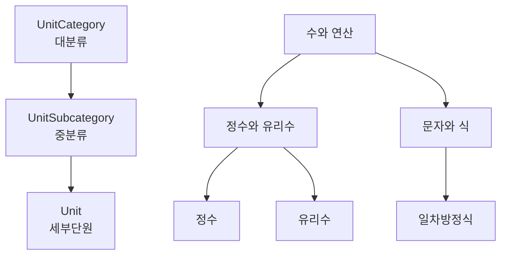
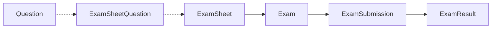
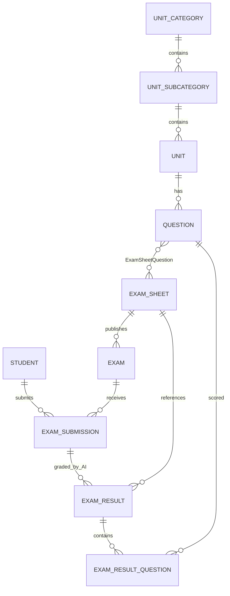
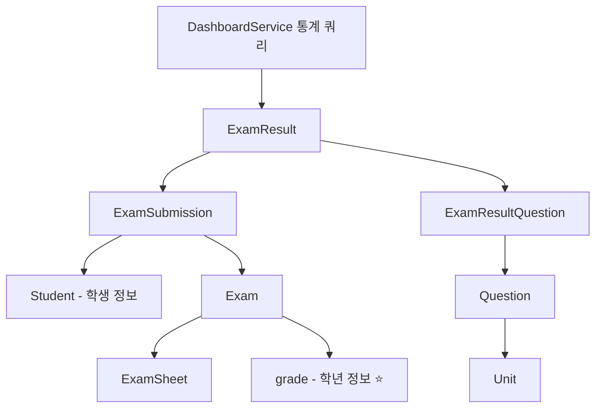

# 🗄️ Entity 관계 문서

> **iRoom 백엔드 시스템의 Entity 관계도 및 데이터 모델 설명서**

## 📋 목차

1. [시스템 개요](#-시스템-개요)
2. [도메인별 Entity 분류](#-도메인별-entity-분류)
3. [핵심 Entity 관계도](#-핵심-entity-관계도)
4. [데이터 흐름](#-데이터-흐름)
5. [주요 비즈니스 규칙](#-주요-비즈니스-규칙)
6. [DashboardController 데이터 관계](#-dashboardcontroller-데이터-관계)
7. [문제 해결을 위한 체크포인트](#-문제-해결을-위한-체크포인트)

---

## 🎯 시스템 개요

iRoom 시스템은 **교육과정 기반의 AI 시험 및 채점 플랫폼**으로, 다음과 같은 핵심 기능을 제공합니다:

- 📚 **교육과정 관리**: 대분류→중분류→세부단원의 계층적 구조
- ❓ **문제 관리**: 단원별 주관식/객관식 문제 생성 및 관리  
- 📝 **시험 관리**: 문제 조합으로 시험지 생성 및 실제 시험 발행
- 👥 **제출 관리**: 학생별 시험 제출 기록
- 🤖 **AI 채점**: 자동 채점 및 재채점 지원
- 📊 **통계 분석**: 학년별, 시험별 성적 분포 및 제출 현황

---

## 🏗️ 도메인별 Entity 분류

### 1. 인증 도메인 (auth)

#### Student (학생)
```java
@Entity
@Table(name = "student")
public class Student {
    @Id Long id;
    String name;           // 학생 이름
    String phone;          // 전화번호 (인증용)
    LocalDate birthDate;   // 생년월일 (인증용)
    LocalDateTime createdAt, updatedAt;
}
```

#### Teacher (선생님)
```java
@Entity  
@Table(name = "teacher")
public class Teacher {
    @Id Long id;
    String username;       // 로그인용 사용자명
    String password;       // 로그인용 비밀번호
    LocalDateTime createdAt, updatedAt;
}
```

### 2. 교육과정 도메인 (curriculum)

#### 계층적 구조: 대분류 → 중분류 → 세부단원



#### UnitCategory (대분류)
```java
@Entity
@Table(name = "unit_category") 
public class UnitCategory {
    @Id UUID id;
    String categoryName;    // 예: "수와 연산", "문자와 식"
    Integer displayOrder;   // 표시 순서
    String description;     // 설명
}
```

#### UnitSubcategory (중분류)
```java
@Entity
@Table(name = "unit_subcategory")
public class UnitSubcategory {
    @Id UUID id;
    @ManyToOne UnitCategory category;     // 대분류와 연결
    String subcategoryName;  // 예: "정수와 유리수", "일차방정식"
    Integer displayOrder;    // 대분류 내 표시 순서
    String description;
}
```

#### Unit (세부단원)
```java
@Entity
@Table(name = "unit")
public class Unit {
    @Id UUID id;
    @ManyToOne UnitSubcategory subcategory; // 중분류와 연결
    Integer grade;          // 학년 (1, 2, 3)
    String unitName;        // 예: "정수", "일차방정식의 해"
    String unitCode;        // 고유 코드
    String description;
    Integer displayOrder;   // 중분류 내 표시 순서
}
```

### 3. 시험 도메인 (exam)

#### 문제 관리

```java
@Entity
@Table(name = "question")
public class Question {
    @Id UUID id;
    @ManyToOne Unit unit;           // 세부단원과 연결 ⭐
    Difficulty difficulty;          // 하/중/상
    String questionText;            // 문제 내용 (JSON)
    String answerText;              // 정답
    String scoringRubric;           // 채점 기준
    QuestionType questionType;      // 주관식/객관식
    String choices;                 // 객관식 선택지 (JSON)
    Integer correctChoice;          // 객관식 정답 번호
    Integer points;                 // 배점
    String image;                   // 이미지 URL (JSON)
}
```

#### 시험지 및 시험 관리



#### ExamSheet (시험지 템플릿)
```java
@Entity
@Table(name = "exam_sheet")
public class ExamSheet {
    @Id UUID id;
    String examName;        // 시험지 이름
    Integer grade;          // 학년
    LocalDateTime createdAt, updatedAt;
    
    @OneToMany List<ExamSheetQuestion> questions; // 문제 목록
}
```

#### ExamSheetQuestion (시험지-문제 연결)
```java
@Entity
@Table(name = "exam_sheet_question")
public class ExamSheetQuestion {
    @Id UUID id;
    @ManyToOne ExamSheet examSheet;  // 시험지
    @ManyToOne Question question;    // 문제
    Integer questionOrder;           // 문제 순서
    Integer points;                  // 해당 시험지에서의 배점
}
```

#### Exam (실제 시험)
```java
@Entity
@Table(name = "exam")  
public class Exam {
    @Id UUID id;
    @ManyToOne ExamSheet examSheet;  // 시험지 템플릿 ⭐
    String examName;                 // 시험명
    Integer grade;                   // 학년 ⭐
    String content;                  // 시험 설명
    String qrCodeUrl;                // QR 코드
    LocalDateTime createdAt;
}
```

#### ExamSubmission (시험 제출)
```java
@Entity
@Table(name = "exam_submission")
public class ExamSubmission {
    @Id UUID id;
    @ManyToOne Exam exam;            // 시험 ⭐
    @ManyToOne Student student;      // 학생 ⭐
    LocalDateTime submittedAt;       // 제출 시간
}
```

#### ExamResult (AI 채점 결과)
```java
@Entity
@Table(name = "exam_result")
public class ExamResult {
    @Id UUID id;
    @ManyToOne ExamSubmission examSubmission;  // 제출과 연결 ⭐
    @ManyToOne ExamSheet examSheet;            // 시험지와 직접 연결 ⭐
    LocalDateTime gradedAt;         // 채점 시간
    Integer totalScore;             // 총점
    ResultStatus status;            // 채점 상태
    String scoringComment;          // 전체 코멘트
    Integer version;                // 재채점 버전
    LocalDateTime createdAt, updatedAt;
    
    @OneToMany List<ExamResultQuestion> questionResults; // 문제별 결과
}
```

#### ExamResultQuestion (문제별 채점 결과)
```java
@Entity  
@Table(name = "exam_result_question")
public class ExamResultQuestion {
    @Id UUID id;
    @ManyToOne ExamResult examResult;     // 시험 결과
    @ManyToOne Question question;         // 문제
    String studentAnswer;                 // 학생 답안
    Integer score;                        // 문제별 점수
    String feedback;                      // 문제별 피드백
    Boolean isCorrect;                    // 정답 여부
}
```

---

## 🔄 핵심 Entity 관계도

### 전체 시스템 관계도



### 데이터 접근 경로 (DashboardService 관점)



---

## 📊 데이터 흐름

### 1. 교육과정 설정 흐름
```
UnitCategory 생성 → UnitSubcategory 생성 → Unit 생성 → Question 생성
```

### 2. 시험 생성 흐름  
```
Question 선별 → ExamSheet 생성 → ExamSheetQuestion 연결 → Exam 발행
```

### 3. 시험 응시 및 채점 흐름
```
Student 로그인 → ExamSubmission 생성 → AI 채점 → ExamResult 생성 → ExamResultQuestion 생성
```

### 4. 통계 조회 흐름 (DashboardService)
```
ExamResult 조회 → ExamSubmission 통해 Student/Exam 정보 획득 → Exam.grade로 학년별 필터링
```

---

## 📋 주요 비즈니스 규칙

### 1. 교육과정 규칙
- **계층 구조**: UnitCategory (1:N) UnitSubcategory (1:N) Unit
- **학년 제한**: Unit은 특정 학년(1,2,3)에만 속함
- **문제 연결**: Question은 반드시 하나의 Unit에 속함

### 2. 시험 규칙
- **시험지 재사용**: 하나의 ExamSheet로 여러 Exam 발행 가능
- **학년 일치**: Exam.grade는 ExamSheet의 포함된 Question들의 Unit.grade와 일치해야 함
- **제출 제한**: 학생은 동일한 Exam에 한 번만 제출 가능 (unique constraint)

### 3. 채점 규칙  
- **AI 자동 채점**: 모든 채점은 AI가 자동 수행
- **재채점 지원**: 동일한 ExamSubmission에 대해 여러 ExamResult 생성 가능 (version 관리)
- **최신 버전**: 통계는 항상 최신 버전(MAX version)의 ExamResult만 사용

### 4. 점수 계산 규칙
- **문제별 점수**: ExamResultQuestion.score 합계가 ExamResult.totalScore
- **시험지 배점**: ExamSheetQuestion.points로 문제별 배점 관리
- **통계 계산**: 학생 평균 = 해당 학생의 모든 시험 ExamResult.totalScore 평균

---

## 🎯 DashboardController 데이터 관계

### 1. 전체 학년 통합 통계 (`getOverallStatistics`)

#### 데이터 흐름
```java
ExamResultRepository.findAllStudentAverageScores()
→ ExamResult JOIN ExamSubmission JOIN Student JOIN Exam  
→ GROUP BY Student, Exam.grade
→ 학생별 평균 성적 + 학년 정보
```

#### 핵심 관계
- `ExamResult → ExamSubmission → Exam.grade` ⭐ (학년 정보)
- `ExamResult → ExamSubmission → Student` ⭐ (학생 정보)

### 2. 학년별 시험 제출 현황 (`getGradeSubmissionStatus`)

#### 데이터 흐름
```java
ExamRepository.findByGrade(grade)  
→ 해당 학년의 모든 Exam 조회
→ ExamSubmissionRepository.countByExamId(exam.id)
→ 시험별 제출 수 집계
```

#### 핵심 관계
- `Exam.grade` ⭐ (학년 필터링)
- `Exam → ExamSubmission` (제출 수 계산)

### 3. 학년별 성적 분포도 (`getGradeScoreDistribution`)

#### 데이터 흐름  
```java
ExamResultRepository.findStudentAverageScoresByGrade(grade)
→ ExamResult JOIN ExamSubmission JOIN Student JOIN Exam
→ WHERE Exam.grade = grade
→ GROUP BY Student
→ 해당 학년 학생들의 평균 성적 분포
```

#### 핵심 관계
- `ExamResult → ExamSubmission → Exam.grade` ⭐ (학년 필터링)
- `ExamResult.totalScore` ⭐ (성적 분포 계산)

---

## 🚨 문제 해결을 위한 체크포인트

### 1. 데이터 불일치 문제 진단

#### 학년별 통계 불일치 시 확인사항
```sql
-- 1. Exam 테이블의 grade 정보 확인
SELECT grade, COUNT(*) FROM exam GROUP BY grade;

-- 2. ExamResult와 Exam의 연결 상태 확인  
SELECT e.grade, COUNT(er.id) 
FROM exam e 
LEFT JOIN exam_submission es ON e.id = es.exam_id
LEFT JOIN exam_result er ON es.id = er.submission_id
GROUP BY e.grade;

-- 3. 최신 버전 ExamResult만 사용하는지 확인
SELECT submission_id, version, COUNT(*) 
FROM exam_result 
GROUP BY submission_id, version 
HAVING COUNT(*) > 1;
```

#### 제출 현황 불일치 시 확인사항
```sql
-- 1. ExamSubmission 테이블의 데이터 무결성 확인
SELECT e.exam_name, COUNT(es.id) as submission_count
FROM exam e
LEFT JOIN exam_submission es ON e.id = es.exam_id
GROUP BY e.id, e.exam_name;

-- 2. 중복 제출 확인 (같은 학생이 같은 시험에 여러 번 제출)
SELECT exam_id, student_id, COUNT(*) 
FROM exam_submission 
GROUP BY exam_id, student_id 
HAVING COUNT(*) > 1;
```

### 2. 성능 최적화 체크포인트

#### N+1 문제 방지
- `@EntityGraph` 또는 `JOIN FETCH` 사용
- Repository의 Projection 인터페이스 활용
- 배치 쿼리로 한 번에 여러 데이터 조회

#### 인덱스 최적화
```sql
-- 필수 인덱스들
CREATE INDEX idx_exam_grade ON exam(grade);
CREATE INDEX idx_exam_submission_exam_id ON exam_submission(exam_id);  
CREATE INDEX idx_exam_submission_student_id ON exam_submission(student_id);
CREATE INDEX idx_exam_result_submission_id ON exam_result(submission_id);
CREATE INDEX idx_exam_result_version ON exam_result(version);
```

### 3. 비즈니스 로직 검증

#### 학년 정보 일관성
```java
// Exam.grade와 ExamSheet에 포함된 Question들의 Unit.grade 일치 확인
@Query("SELECT e FROM Exam e WHERE e.grade != " +
       "(SELECT DISTINCT u.grade FROM ExamSheetQuestion esq " +
       "JOIN esq.question q JOIN q.unit u " + 
       "WHERE esq.examSheet = e.examSheet)")
List<Exam> findGradeInconsistentExams();
```

#### 채점 결과 완전성
```java
// ExamResult.totalScore가 ExamResultQuestion 점수 합계와 일치하는지 확인
@Query("SELECT er FROM ExamResult er WHERE er.totalScore != " +
       "(SELECT COALESCE(SUM(erq.score), 0) FROM ExamResultQuestion erq " +
       "WHERE erq.examResult = er)")
List<ExamResult> findInconsistentTotalScores();
```

---

## 📚 참고 정보

### Entity 파일 위치
```
src/main/java/com/iroomclass/springbackend/domain/
├── auth/entity/
│   ├── Student.java
│   └── Teacher.java
├── curriculum/entity/
│   ├── UnitCategory.java
│   ├── UnitSubcategory.java
│   └── Unit.java
└── exam/entity/
    ├── Question.java
    ├── ExamSheet.java
    ├── ExamSheetQuestion.java
    ├── Exam.java
    ├── ExamSubmission.java
    ├── ExamResult.java
    └── ExamResultQuestion.java
```

### Repository 주요 메서드
- `ExamResultRepository.findAllStudentAverageScores()` - 전체 학생 평균 성적
- `ExamResultRepository.findStudentAverageScoresByGrade(grade)` - 학년별 학생 평균 성적
- `ExamRepository.findByGrade(grade)` - 학년별 시험 목록
- `ExamSubmissionRepository.countByExamId(examId)` - 시험별 제출 수

---

**📝 이 문서는 DashboardController의 데이터 불일치 문제 해결 및 향후 개발을 위해 작성되었습니다.**  
**Entity 관계 변경 시에는 반드시 이 문서도 함께 업데이트해 주세요.**