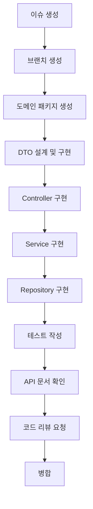

# 🤝 팀 협업 가이드

> **효율적인 팀 협업을 위한 워크플로우 및 프로세스 가이드**

## 📋 목차

1. [협업 워크플로우](#-협업-워크플로우)
2. [개발 프로세스](#-개발-프로세스)
3. [코드 리뷰 가이드라인](#-코드-리뷰-가이드라인)
4. [Git 브랜치 전략](#-git-브랜치-전략)
5. [커뮤니케이션 규칙](#-커뮤니케이션-규칙)

---

## 🔄 협업 워크플로우

### 기능 개발 프로세스



### 개발 단계별 체크리스트

#### 📋 설계 단계
- [ ] 도메인 식별 및 패키지 구조 설계
- [ ] API 명세서 작성 (OpenAPI)
- [ ] 데이터베이스 스키마 설계
- [ ] DTO 구조 설계

#### 📋 구현 단계
- [ ] Domain 패키지 생성 (`domain/{module}/`)
- [ ] DTO Record 구현 + Validation
- [ ] Controller 구현 + @Tag, @Operation
- [ ] Service 구현 + @Transactional
- [ ] Repository 구현 (필요 시)
- [ ] Entity 구현 (필요 시)

#### 📋 품질 보증 단계
- [ ] 단위 테스트 작성
- [ ] 통합 테스트 작성
- [ ] API 문서 검증 (Swagger UI)
- [ ] **[코딩 표준](CODING_STANDARDS.md)** 준수 확인
- [ ] JavaDoc 작성 완료

#### 📋 코드 리뷰 단계
- [ ] 패키지 구조 올바름
- [ ] Record 사용 확인
- [ ] 생성자 주입 패턴 사용
- [ ] ApiResponse 래핑 확인
- [ ] 한국어 JavaDoc 작성
- [ ] @Schema 어노테이션 완료
- [ ] 테스트 커버리지 확인

---

## 🛠️ 개발 프로세스

### 이슈 관리

#### 이슈 생성 규칙
```markdown
**제목**: [타입] 간단한 설명
**예시**: [FEAT] 사용자 관리 API 구현

**내용 템플릿**:
## 📋 작업 내용
- 구현할 기능 상세 설명

## 🎯 완료 조건
- [ ] API 엔드포인트 구현
- [ ] 테스트 작성
- [ ] 문서화 완료

## 📚 참고 자료
- 관련 문서 링크
```

#### 이슈 라벨 시스템
| 라벨 | 용도 | 우선순위 |
|------|------|----------|
| `feature` | 새로운 기능 | 보통 |
| `bug` | 버그 수정 | 높음 |
| `hotfix` | 긴급 수정 | 최고 |
| `refactor` | 리팩토링 | 낮음 |
| `docs` | 문서 작업 | 낮음 |
| `test` | 테스트 작업 | 보통 |

### 작업 시간 관리

#### 개발 시간 가이드라인
| 작업 유형 | 예상 시간 | 복잡도 |
|-----------|-----------|--------|
| **CRUD API** | 4-8시간 | 낮음 |
| **복잡한 비즈니스 로직** | 1-2일 | 보통 |
| **외부 시스템 연동** | 2-3일 | 높음 |
| **성능 최적화** | 3-5일 | 높음 |

#### 시간 추적 규칙
- 이슈 시작 시 예상 시간 기록
- 일일 진행 상황 업데이트
- 완료 시 실제 소요 시간 기록

---

## 👀 코드 리뷰 가이드라인

### 리뷰어 체크사항

#### 1. 아키텍처 및 설계
- [ ] **[아키텍처 문서](ARCHITECTURE.md)** 원칙 준수
- [ ] Domain-Driven Package 구조 사용
- [ ] 적절한 계층 분리 (Controller-Service-Repository)
- [ ] 단일 책임 원칙 준수

#### 2. 코딩 스타일
- [ ] **[코딩 표준](CODING_STANDARDS.md)** 준수
- [ ] Java 21 Record 사용 (DTO)
- [ ] 생성자 주입 패턴 사용
- [ ] 한국어 JavaDoc 작성

#### 3. API 설계
- [ ] **[API 가이드라인](API_GUIDELINES.md)** 준수
- [ ] RESTful 원칙 적용
- [ ] 표준 응답 형식 (ApiResponse) 사용
- [ ] 적절한 HTTP 상태 코드 사용

#### 4. 보안 및 검증
- [ ] 입력 데이터 검증
- [ ] 권한 확인 (@PreAuthorize)
- [ ] SQL Injection 방지
- [ ] 민감 정보 로깅 금지

#### 5. 성능 및 품질
- [ ] N+1 문제 확인
- [ ] 적절한 트랜잭션 범위
- [ ] 테스트 커버리지 확인
- [ ] 메모리 누수 가능성 검토

### 리뷰 요청 시 포함사항

#### Pull Request 템플릿
```markdown
## 📋 변경 사항
- 구현한 기능 및 변경 내용

## 🧪 테스트
- [ ] 단위 테스트 작성
- [ ] 통합 테스트 작성
- [ ] 수동 테스트 완료

## 📚 문서
- [ ] API 문서 업데이트 (Swagger)
- [ ] JavaDoc 작성
- [ ] README 업데이트 (필요 시)

## 🔍 리뷰 포인트
- 특별히 검토받고 싶은 부분

## 📸 스크린샷 (UI 변경 시)
- 변경 전/후 스크린샷
```

---

## 🌿 Git 브랜치 전략

### 브랜치 구조

```
main (운영)
├── develop (개발)
│   ├── feature/user-management
│   ├── feature/order-system
│   └── feature/payment-integration
├── hotfix/critical-bug-fix
└── release/v1.0.0
```

### 브랜치 명명 규칙

| 브랜치 타입 | 네이밍 | 예시 |
|-------------|--------|------|
| **Feature** | `feature/{기능명}` | `feature/user-management` |
| **Bugfix** | `bugfix/{버그명}` | `bugfix/login-error` |
| **Hotfix** | `hotfix/{수정명}` | `hotfix/security-patch` |
| **Release** | `release/v{버전}` | `release/v1.0.0` |

### 커밋 메시지 규칙

#### 커밋 메시지 형식
```
{타입}: {제목}

{본문}

{푸터}
```

#### 타입 분류
| 타입 | 설명 | 예시 |
|------|------|------|
| `feat` | 새로운 기능 | `feat: 사용자 로그인 API 추가` |
| `fix` | 버그 수정 | `fix: 비밀번호 검증 로직 수정` |
| `docs` | 문서 수정 | `docs: API 가이드라인 업데이트` |
| `style` | 코드 포맷팅 | `style: 코딩 컨벤션 적용` |
| `refactor` | 리팩토링 | `refactor: UserService 로직 개선` |
| `test` | 테스트 추가 | `test: UserController 단위 테스트 추가` |
| `chore` | 빌드/설정 변경 | `chore: Gradle 버전 업데이트` |

#### 커밋 메시지 예시
```bash
feat: 사용자 관리 API 구현

- 사용자 조회, 생성, 수정, 삭제 API 추가
- UserDto, CreateUserRequest, UpdateUserRequest 구현
- 입력 검증 및 에러 처리 로직 추가
- Swagger API 문서화 완료

Resolves: #123
```

---

## 💬 커뮤니케이션 규칙

### Slack 채널 활용

| 채널 | 용도 | 참여자 |
|------|------|--------|
| `#dev-general` | 일반 개발 논의 | 전체 개발팀 |
| `#dev-support` | 기술 지원 요청 | 전체 개발팀 |
| `#code-review` | 코드 리뷰 알림 | 전체 개발팀 |
| `#deploy` | 배포 알림 | 전체 팀 |

### 미팅 규칙

#### 일일 스탠드업 (Daily Standup)
- **시간**: 매일 오전 10시
- **소요 시간**: 15분
- **형식**: 
  - 어제 한 일
  - 오늘 할 일
  - 블로커 사항

#### 주간 회고 (Weekly Retrospective)
- **시간**: 매주 금요일 오후 5시
- **소요 시간**: 30분
- **형식**:
  - 잘한 점 (Keep)
  - 개선할 점 (Problem)
  - 시도할 것 (Try)

### 문서화 규칙

#### 실시간 문서 업데이트
- 새로운 API 추가 시 즉시 문서 업데이트
- 프로세스 변경 시 관련 문서 수정
- 월 1회 문서 전체 검토 및 정리

#### 지식 공유
- 새로운 기술 학습 시 팀 공유
- 트러블슈팅 경험 문서화
- 베스트 프랙티스 정기 공유

---

## 🎯 성과 측정

### 개발 품질 지표

| 지표 | 목표 | 측정 방법 |
|------|------|-----------|
| **코드 리뷰 커버리지** | 100% | PR 통계 |
| **테스트 커버리지** | 80% 이상 | SonarQube |
| **배포 성공률** | 95% 이상 | 배포 로그 |
| **이슈 해결 시간** | 3일 이내 | 이슈 트래커 |

### 팀 협업 지표

| 지표 | 목표 | 측정 방법 |
|------|------|-----------|
| **코드 리뷰 응답 시간** | 24시간 이내 | GitHub 통계 |
| **문서 업데이트 빈도** | 주 1회 이상 | Git 로그 |
| **지식 공유 횟수** | 월 2회 이상 | 미팅 기록 |

---

## 📚 관련 문서

- **[코딩 표준](CODING_STANDARDS.md)** - 코딩 컨벤션 및 스타일 가이드
- **[API 가이드라인](API_GUIDELINES.md)** - REST API 설계 규칙
- **[환경 설정 가이드](SETUP_GUIDE.md)** - 개발 환경 설정
- **[아키텍처 문서](ARCHITECTURE.md)** - 시스템 아키텍처
- **[문제 해결 가이드](TROUBLESHOOTING.md)** - FAQ 및 트러블슈팅

---

**📝 이 문서는 팀의 실제 개발 프로세스를 반영하여 작성되었습니다.**  
**프로세스 개선 제안이나 문의사항은 언제든 팀 리드에게 연락해 주세요.**